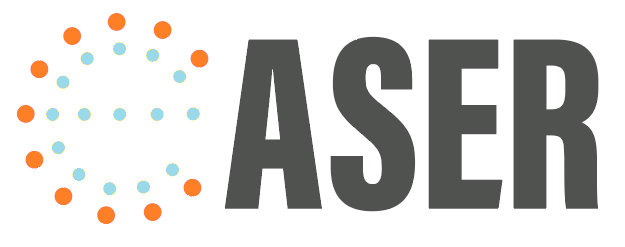

# ASER (Activities, States, Events, and their Relations)



ASER is a large-scale weighted eventuality knowledge graph, including actions, states, events, and their relations.

The eventualities (i.e., nodes of ASER) are extracted using selected dependency patterns.
The edges are based on discourse relations (e.g., Result) in discourse analysis.

Besides, conceptualized eventualities in a more abstract level and their relations are also conducted to generalize the knowledge.

In total, ASER (full) contains 438 million eventualities and 648 million edges between eventualities;
ASER (core) contains 53 million eventualities and 52 million edges between eventualities.

With the help of [Probase](https://concept.research.microsoft.com/)  (now called Microsoft Concept Graph), ASER (concept) contains 15 million conceptualized eventualities and 224 million edges between conceptualied eventualities.

We also provide a copy of Probase [download](https://hkustconnect-my.sharepoint.com/:f:/g/personal/zwanggy_connect_ust_hk/Eq5-W3acwqpIrP2xX60C3cgBRxq8dZsgzEcuKl_60ZPaMw?e=DSs7Jb) 
from MSRA's official website. All licenses are subject to MSRA's original release.

The homepage of the project and data is [https://hkust-knowcomp.github.io/ASER](https://hkust-knowcomp.github.io/ASER/).

The online [demo](http://songcpu1.cse.ust.hk/aser/demo) is coming soon.

* ASER 2.1 (dev): using original text tokens as eventualities (set *use_lemma=False* when using extractors) and checking the completeness via the dependency parser. [[code branch](https://github.com/HKUST-KnowComp/ASER/tree/dev)] [[data](https://hkustconnect-my.sharepoint.com/:f:/g/personal/xliucr_connect_ust_hk/Erraz2_KGjFHtbP9bh2-HMoBjCKGYX887MMzLX2y7xbs0w?e=314jRS)]

* ASER 2.0 (AIJ"2022): ASER: Towards Large-scale Commonsense Knowledge Acquisition via Higher-order Selectional Preference over Eventualities. [[pdf](https://arxiv.org/abs/2104.02137)] [[code branch](https://github.com/HKUST-KnowComp/ASER/tree/release/2.0)] [[data](https://hkustconnect-my.sharepoint.com/:f:/g/personal/xliucr_connect_ust_hk/EnlOIunfqNRKsCQIBSXe9pQBL0KhLxTNMSNSJ3Mzt0bmhA?e=xm86PF)]

* ASER 1.0 (WWW"2020): ASER: A Large-scale Eventuality Knowledge Graph. [[pdf](https://arxiv.org/abs/1905.00270)] [[code branch](https://github.com/HKUST-KnowComp/ASER/tree/release/1.0)] [[data](https://hkustconnect-my.sharepoint.com/:f:/g/personal/xliucr_connect_ust_hk/EoNC-hFNEsNLrZvg73i14e8BMAUDR20TmuLY0W-6tFhKEQ?e=BveOrc)]
### Quick Start

Please refer to the [get_started.ipynb](examples/get_started.ipynb) or [documentation](https://hkust-knowcomp.github.io/ASER/html/tutorial/get-started.html) to become familiar with ASER and its construction pipeline.

### References
```
@article{ZhangLPKOFS22,
  author    = {Hongming Zhang and
               Xin Liu and
               Haojie Pan and
               Haowen Ke and
               Jiefu Ou and
               Tianqing Fang and
               Yangqiu Song},
  title     = {{ASER:} Towards Large-scale Commonsense Knowledge Acquisition via Higher-order Selectional Preference over Eventualities},
  journal   = {Artificial Intelligence},
  volume    = {309},
  pages     = {103740},
  year      = {2022},
}

@inproceedings{ZhangLPSL20,
  author    = {Hongming Zhang and
               Xin Liu and
               Haojie Pan and
               Yangqiu Song and
               Cane Wing{-}Ki Leung},
  title     = {{ASER:} {A} Large-scale Eventuality Knowledge Graph},
  booktitle = {WWW},
  pages     = {201--211},
  year      = {2020}
}
```
